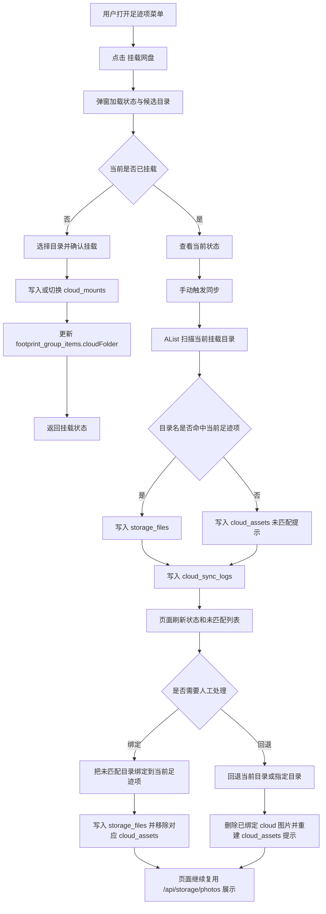
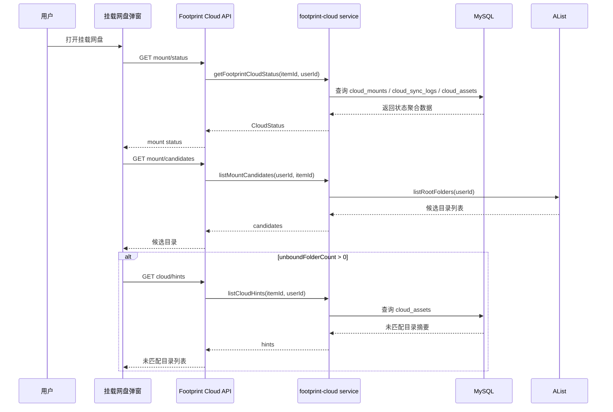
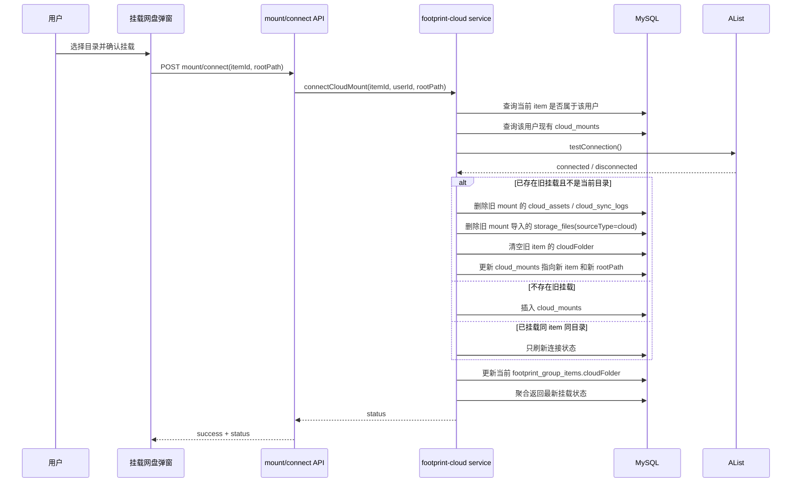
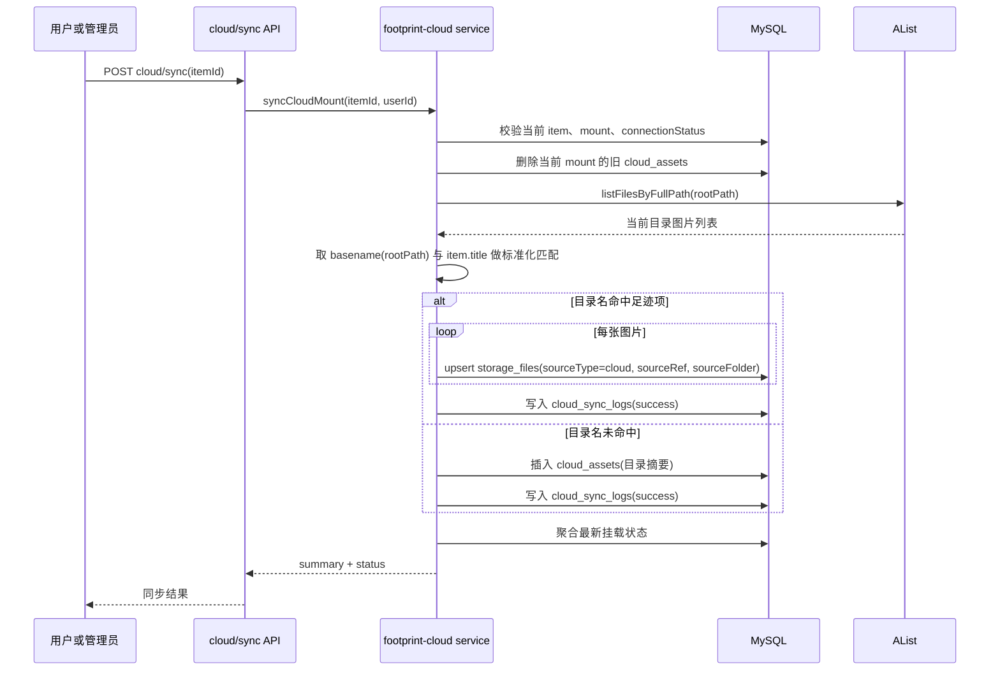
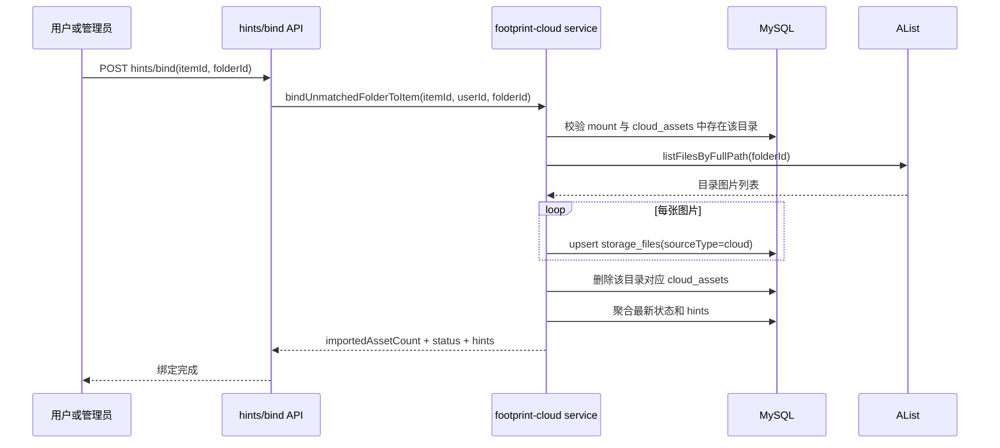
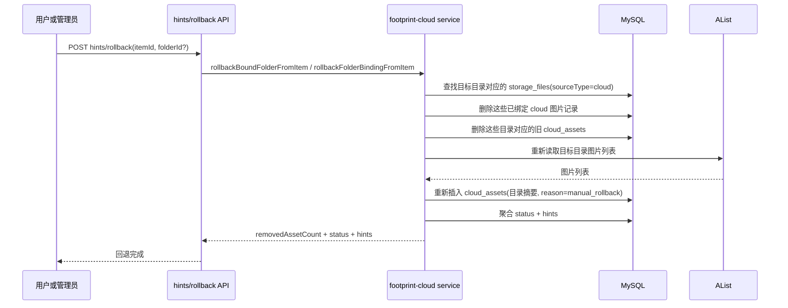
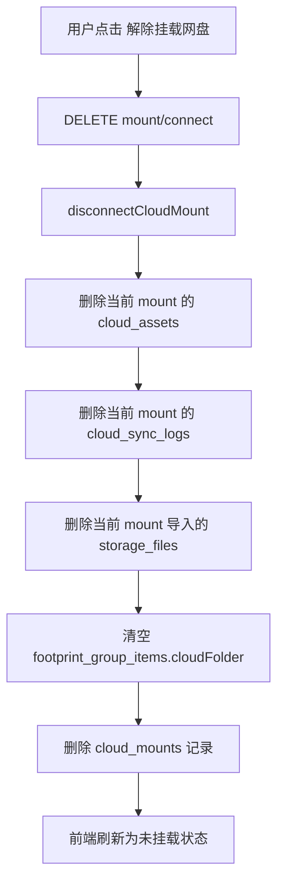
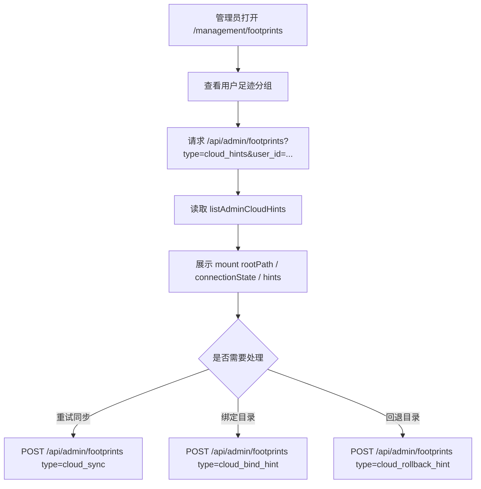

# 挂载网盘工作流程图

## 目标

- 用当前代码实现视角，说明 Footprint「挂载网盘」能力的真实执行流程
- 统一用户端、服务端、AList、数据库、管理端之间的协作关系
- 作为后续联调、自测、补 migration、扩展能力时的对照文档

## 当前收口前提

- 对外统一语义为 `挂载网盘`
- 当前服务端只支持 `每个用户一条挂载记录`
- 一条挂载记录只服务 `一个足迹项`
- 当前挂载对象本质上是 `一个目录`
- 当前只同步 `当前挂载目录`
- 命中地点后，云端图片写入 `storage_files`，继续复用现有 Footprint 图片展示链路
- 未命中地点时，只写 `cloud_assets` 提示，不进入正式展示

## 参与对象

- 用户端 Footprint 页面
- 挂载网盘弹窗
- 管理端 `/management/footprints`
- Footprint Cloud API
- `src/services/footprint-cloud.ts`
- `src/services/alist.ts`
- `storage_files`
- `cloud_mounts`
- `cloud_sync_logs`
- `cloud_assets`

## 总览流程图



## 1. 弹窗初始化流程

### 入口

- 用户端：`/user/footprints`
- 操作入口：足迹项菜单中的 `挂载网盘`

### 相关接口

- `GET /api/footprints/cloud/mount/status?itemId=...`
- `GET /api/footprints/cloud/mount/candidates?itemId=...`
- `GET /api/footprints/cloud/hints?itemId=...` 仅在存在未匹配目录时触发

### 流程图



### 结果

- 弹窗会先拿到当前足迹项的挂载状态
- 再拿候选目录列表
- 若状态里存在未匹配目录数，再加载未匹配区详情
- 前端据此决定按钮文案：
  - 未挂载
  - 已挂载，连接正常
  - 已挂载，连接异常

## 2. 建立挂载流程

### 相关接口

- `POST /api/footprints/cloud/mount/connect`

### 核心规则

- 同一用户只保留一条 `cloud_mounts`
- 若用户已挂载别的足迹项，再次挂载会直接切换到新的足迹项
- 切换前会清理旧挂载导入的云图、同步日志、未匹配提示

### 流程图



### 数据影响

- `cloud_mounts`
  - 建立或复用该用户唯一挂载记录
- `footprint_group_items.cloudFolder`
  - 记录当前足迹项对应的挂载目录
- 旧挂载若被替换：
  - 清空旧目录导入的 `storage_files`
  - 删除旧挂载的 `cloud_assets`
  - 删除旧挂载的 `cloud_sync_logs`

## 3. 手动同步流程

### 相关接口

- `POST /api/footprints/cloud/sync`

### 当前实现规则

- 只扫描当前 `mount.rootPath`
- 用 `path.basename(rootPath)` 与当前足迹项标题做标准化精确匹配
- 命中则把目录内所有图片写入 `storage_files`
- 未命中则只写一条目录级 `cloud_assets` 摘要
- 每次同步前会先清空当前 mount 下旧的 `cloud_assets`

### 流程图



### 同步结果去向

- `storage_files`
  - 正式展示数据
- `cloud_assets`
  - 未匹配提示数据
- `cloud_sync_logs`
  - 最近同步时间、结果摘要

## 4. 图片展示流程

### 当前设计

- 云端图片没有单独的前台展示接口
- 统一通过 `storage_files` 并入现有 Footprint 图片流
- 前端继续走 `/api/storage/photos`

### 流程图

```mermaid
flowchart LR
    A[用户打开地点图片区域] --> B[/api/storage/photos]
    B --> C[storage service listPhotos]
    C --> D[查询 storage_files]
    D --> E{sourceType 是否为 cloud}
    E -- 否 --> F[返回本地文件 URL]
    E -- 是 --> G[按 sourceFolder 调 AList listFilesByFullPath]
    G --> H[按 文件名 映射 url / thumb]
    H --> I[与本地图片统一返回给页面]
```

### 含义

- 页面层不区分本地图片还是云端图片
- 只要云图成功写进 `storage_files`，它就会进入当前地点的正式展示

## 5. 未匹配提示与人工绑定流程

### 相关接口

- `GET /api/footprints/cloud/hints`
- `POST /api/footprints/cloud/hints/bind`

### 适用场景

- 当前挂载目录名没有命中当前足迹项标题
- 或者之前回退后，需要重新人工绑定

### 流程图



### 结果

- 目录内图片正式并入当前足迹项展示
- 对应未匹配提示从 `cloud_assets` 中移除

## 6. 回退流程

### 相关接口

- `POST /api/footprints/cloud/hints/rollback`

### 当前支持两种回退

- 不带 `folderId`
  - 回退当前挂载目录
- 带 `folderId`
  - 只回退指定目录

### 流程图



### 结果

- 已经进入正式展示的云图会从 `storage_files` 移除
- 目录重新回到“未匹配提示”状态
- 这一步不会删除远端网盘文件，只调整 Trip 侧绑定关系

## 7. 解除挂载流程

### 相关接口

- `DELETE /api/footprints/cloud/mount/connect?itemId=...`

### 流程图



## 8. 管理端工作流

### 当前能力

- 查看某用户当前挂载目录
- 查看连接状态
- 查看未匹配目录数、图片数、样例图
- 触发同步
- 绑定未匹配目录
- 回退已绑定图片

### 流程图



## 9. 数据流向图

```mermaid
flowchart LR
    A[AList 当前目录图片] --> B[syncCloudMount / bindUnmatchedFolderToItem]
    B --> C[storage_files]
    A --> D[目录未命中或回退后]
    D --> E[cloud_assets]
    B --> F[cloud_sync_logs]
    G[connectCloudMount] --> H[cloud_mounts]
    H --> I[footprint_group_items.cloudFolder]
    C --> J[/api/storage/photos]
    J --> K[Footprint 页面正式图片展示]
    E --> L[/api/footprints/cloud/hints]
    L --> M[弹窗未匹配区 / 管理端提示区]
```

## 10. 自测时建议按此顺序核对

1. 未挂载足迹项打开弹窗，确认能拉到候选目录。
2. 选择目录后挂载，确认 `mount/status` 变为已挂载。
3. 执行同步，确认命中时云图进入当前地点展示。
4. 执行同步，确认未命中时只出现未匹配提示，不进入正式展示。
5. 对未匹配目录执行手动绑定，确认图片进入展示且提示消失。
6. 对已绑定目录执行“回退该目录”，确认图片退出展示且提示恢复。
7. 对当前挂载目录执行整批回退，确认目录重新回到未匹配状态。
8. 解除挂载，确认 `storage_files`、`cloud_assets`、`cloud_sync_logs`、`cloud_mounts` 清理一致。

## 11. 当前流程与早期草案的差异

- 不是“扫描一个 root 下多个地点目录再批量匹配多个足迹项”。
- 当前实现是“一个用户只保留一个挂载目录，并且该目录只服务一个足迹项”。
- 不是独立 cloud view DTO 展示链路。
- 当前实现是先写入 `storage_files`，再复用已有 Footprint 图片展示接口。
- 不是只支持整批回退。
- 当前实现已支持“当前挂载目录整批回退 + 指定目录粒度回退”。
